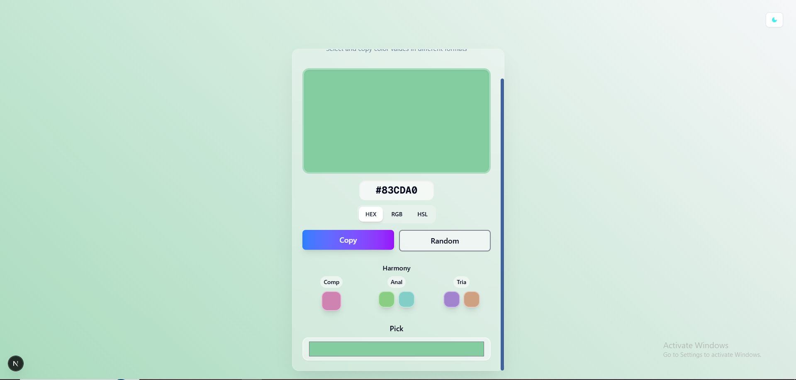

# Advanced Color Picker Web Application

A sleek and modern color picker built with Next.js, offering real-time color format conversion, color harmony suggestions, and an intuitive user interface with enhanced accessibility features.

## Features
- 🎨 Interactive color selection with visual preview
- 🔄 Real-time color format conversion (HEX/RGB/HSL)
- 📋 Quick copy-to-clipboard functionality
- 🌓 Dark/Light theme toggle
- 🌈 Dynamic background gradient
- 📱 Responsive design
- 🚀 Fast and lightweight
- 🔍 Color name identification
- 🎭 Color harmony suggestions (complementary, analogous, triadic)
- 🕒 Recent colors history with local storage
- 🎲 Random color generator
- ⌨️ Keyboard shortcuts support
- ♿ Enhanced accessibility features
- 🎨 Improved aesthetic design with modern UI elements

## Screenshots


## Tech Stack
- Next.js 15.5.9
- TypeScript
- Tailwind CSS v4
- Shadcn/ui
- React Hot Toast
- Radix UI

## Getting Started

### Prerequisites
- Node.js 18+
- npm/yarn/pnpm

### Installation

1. Clone the repository
```bash
git clone https://github.com/OsamabinAdnan/Nextjs_Apps/tree/main/30_days_30_projects.git
cd 08_color_picker
```

2. Install dependencies
```bash
npm install
```

3. Start development server
```bash
npm run dev
```

4. Open browser at `http://localhost:3000`

## Project Structure
```
08_color_picker/
├── app/
│   ├── favicon.ico
│   ├── globals.css
│   ├── layout.tsx
│   └── page.tsx
├── components/
│   ├── color_picker.tsx
│   ├── Theme_Toggle.tsx
│   ├── TypeDeclaration.ts
│   └── ui/
│       ├── button.tsx
│       ├── card.tsx
│       └── input.tsx
├── lib/
│   ├── colorUtils.ts
│   └── hooks/
│       └── useColorConverter.ts
│   └── utils.ts
├── public/
│   ├── file.svg
│   ├── globe.svg
│   ├── next.svg
│   ├── vercel.svg
│   └── window.svg
└── README.md
```

## Usage
1. Use the color input field to select a color
2. Switch between color formats using HEX/RGB/HSL buttons
3. Click "Copy to Clipboard" to copy the current color value
4. Toggle between light/dark themes using the theme switch
5. Generate random colors with the "Random Color" button
6. View recent colors in the history section
7. Explore color harmonies (complementary, analogous, triadic)
8. Use keyboard shortcuts:
   - Ctrl/Cmd + H: Switch to HEX format
   - Ctrl/Cmd + R: Switch to RGB format
   - Ctrl/Cmd + S: Switch to HSL format
   - Ctrl/Cmd + G: Generate random color

## Key Features Explained

### Color Formats
The app supports three color formats:
- **HEX**: Standard 6-digit hexadecimal color code (e.g., #FF5733)
- **RGB**: Red, Green, Blue values (e.g., rgb(255, 87, 51))
- **HSL**: Hue, Saturation, Lightness values (e.g., hsl(12, 100%, 60%))

### Color Harmony
Discover related colors based on color theory:
- **Complementary**: Colors opposite on the color wheel
- **Analogous**: Colors adjacent to each other on the color wheel
- **Triadic**: Three colors evenly spaced around the color wheel

### Recent Colors
- Automatically saves recently used colors
- Persists across sessions using localStorage
- Easy access to previous selections

### Theme Toggle
- Seamlessly switch between light and dark modes
- Theme preference is saved in local storage
- UI elements automatically adjust to current theme

### Accessibility Features
- Full keyboard navigation support
- ARIA labels for screen readers
- High contrast mode support
- Reduced motion preferences
- Proper focus management

### Responsive Design
- Adapts to different screen sizes
- Mobile-friendly interface
- Smooth animations and transitions

## Contributing
1. Fork the project
2. Create your feature branch (`git checkout -b feature/AmazingFeature`)
3. Commit changes (`git commit -m 'Add AmazingFeature'`)
4. Push to branch (`git push origin feature/AmazingFeature`)
5. Open a Pull Request

## License
Distributed under the MIT License. See `LICENSE` for more information.

## Contact
Your Name - [@osamabinadnan](https://www.linkedin.com/in/osama-bin-adnan/)

Project Link: [https://github.com/OsamabinAdnan/Nextjs_Apps/tree/main/30_days_30_projects/08_color_picker](https://github.com/OsamabinAdnan/Nextjs_Apps/tree/main/30_days_30_projects/08_color_picker)

---

Built with ❤️ using Next.js and TypeScript