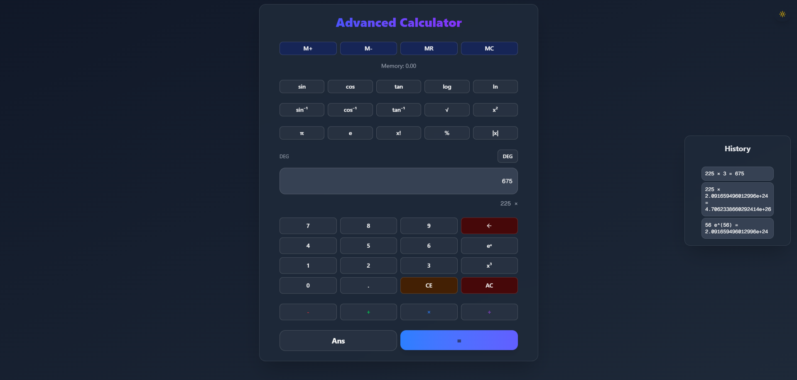

# Advanced 3D Calculator

A modern, interactive calculator built with Next.js, TypeScript, and Tailwind CSS featuring dark mode support, smooth animations, and 3D visualizations using Three.js. This advanced calculator includes scientific functions, memory operations, and a comprehensive set of mathematical tools.

## App deployed Link
🔗 [Calculator](https://standard-calculator-osamabinadnan.netlify.app/)

## App Screenshot



## 🌟 Features

- **Responsive Design**: Works seamlessly on desktop and mobile devices
- **Dark Mode**: Toggle between light and dark themes
- **Input Validation**: Comprehensive error checking for calculations
- **Smooth Animations**: Pleasant user experience with fluid transitions
- **3D Visualizations**: Real-time 3D graphics using Three.js that respond to calculations
- **Scientific Functions**: Complete set of trigonometric, logarithmic, and exponential functions
- **Memory Operations**: M+, M-, MR, MC functions for storing and retrieving values
- **Constants Library**: Access to π, e, φ and other important mathematical constants
- **Calculation History**: Track and review previous calculations
- **Advanced Operations**: Square, cube, square root, factorial, absolute value, and more
- **Angle Mode**: Toggle between degrees and radians for trigonometric functions
- **Error Handling**: Clear error messages for invalid operations
- **Accessible**: Built with accessibility in mind using ARIA labels

## 🛠️ Technologies Used

- Next.js 15
- TypeScript
- Tailwind CSS
- Three.js
- Shadcn UI Components
- Lucide Icons

## 🚀 Getting Started

### Prerequisites

- Node.js (v18 or higher)
- npm or yarn

### Installation

1. Clone the repository:
```bash
git clone https://github.com/OsamabinAdnan/Nextjs_Apps/tree/main/30_days_30_projects/05_simple_calculator.git
```

2. Navigate to project directory:
```bash
cd 05_simple_calculator
```

3. Install dependencies:
```bash
npm install
# or
yarn install
```

4. Run the development server:
```bash
npm run dev
# or
yarn dev
```

5. Open your browser and visit:
```
http://localhost:3000
```

## 💻 Usage

### Basic Operations
1. Use the number pad to enter values
2. Click on operation buttons (+, -, ×, ÷) to perform calculations
3. Press "=" to compute the result
4. View the 3D visualization that responds to your calculations

### Scientific Functions
- **Trigonometry**: sin, cos, tan, asin, acos, atan
- **Logarithms**: log (base 10), ln (natural log)
- **Powers & Roots**: x², x³, √x, eˣ
- **Special Functions**: factorial (!), absolute value (|x|), percentage (%)

### Memory Functions
- **M+**: Add current result to memory
- **M-**: Subtract current result from memory
- **MR**: Recall value from memory
- **MC**: Clear memory

### Constants
- **π**: Pi constant
- **e**: Euler's number
- **φ**: Golden ratio

### Advanced Features
- **Angle Mode**: Toggle between degrees (DEG) and radians (RAD)
- **Ans**: Recall the last calculation result
- **Backspace**: Remove the last digit entered
- **CE**: Clear entry (reset current input)
- **AC**: All clear (reset everything)

## 🎨 Customization

### Themes
The calculator supports both light and dark modes. Click the theme toggle button in the top-right corner to switch between themes.

### 3D Visualization
The 3D visualization adapts to your calculations:
- Different shapes represent different operations
- Colors change based on result values
- Rotation speed varies with result magnitude
- Scaling effects respond to calculation results

### Styling
The UI is built with Tailwind CSS and can be customized by modifying the classes in the component files.

## 🔧 Component Structure

```typescript
Calculator/
├── calculator.tsx          // Main calculator component
├── ThreeJSVisualization.tsx // 3D visualization component
├── ui/                     // UI components
│   ├── button.tsx
│   ├── card.tsx
│   ├── input.tsx
│   └── label.tsx
```

## 🚦 Error Handling

The calculator includes comprehensive error handling for:
- Division by zero
- Invalid inputs
- Domain errors in functions (e.g., taking square root of negative numbers)
- Range errors in inverse trigonometric functions
- Factorial of non-integers or negative numbers

## 🤝 Contributing

1. Fork the repository
2. Create your feature branch (`git checkout -b feature/AmazingFeature`)
3. Commit your changes (`git commit -m 'Add some AmazingFeature'`)
4. Push to the branch (`git push origin feature/AmazingFeature`)
5. Open a Pull Request

## Live Demo
[Advanced 3D Calculator](https://standard-calculator-osamabinadnan.vercel.app/)

## 📝 License

This project is licensed under the MIT License - see the [LICENSE.md](LICENSE.md) file for details.

## 🙏 Acknowledgments

- [Next.js](https://nextjs.org/)
- [Tailwind CSS](https://tailwindcss.com/)
- [Three.js](https://threejs.org/)
- [Shadcn UI](https://ui.shadcn.com/)
- [Lucide Icons](https://lucide.dev/)

## 📞 Contact

Your Name - [@yourtwitter](https://twitter.com/yourtwitter)

Project Link: [https://github.com/OsamabinAdnan/Nextjs_Apps/tree/main/30_days_30_projects/05_simple_calculator](https://github.com/OsamabinAdnan/Nextjs_Apps/tree/main/30_days_30_projects/05_simple_calculator)